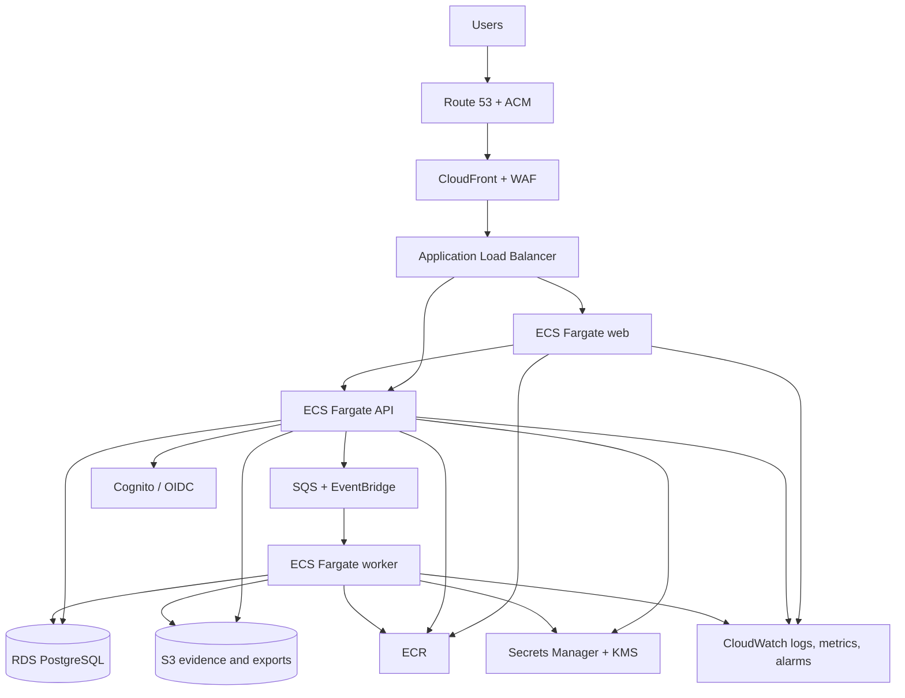

# CampaignOS deployment architecture

Status: **PROPOSED TARGET; NOT DEPLOYED**
Last updated: `2026-07-19`

## Current state

The only public surface observed during the foundation audit is a static GitHub Pages demo. It is `DEMO_NON_PRODUCTION`, manual-only, and excluded from all production evidence. A digest-pinned, loopback-only local Compose stack now exercises a non-root API, PostgreSQL, S3Mock and Mailpit with health checks and migration rehearsal. This local stack is developer/test evidence only; the repository still contains no verified AWS environment.

## Target AWS baseline

## Environment isolation

Development, staging, and production use separate Terraform roots, state, credentials/roles, secrets, databases, buckets, queues, log groups, and deployment approvals. Terraform CLI workspaces are not the sole isolation boundary. Production data resources require deletion protection and reviewed backup/restore policy.

GitHub Actions uses short-lived OIDC federation; static AWS access keys are prohibited. Pull requests may validate and plan non-production infrastructure without applying. Main may deploy development only after required checks. Staging promotion is explicit. Production plan/apply requires the separate human approval gate and a recorded receipt.

## Runtime controls

- Containers run as non-root from immutable digests with health/readiness checks and graceful shutdown.
- Only the load balancer is internet-facing; API, workers, database, queues, and administrative endpoints use private networking where supported.
- Database and object data are encrypted in transit and at rest with scoped KMS policies.
- Egress and IAM permissions are least privilege; model providers and integrations use explicit allow-lists.
- Database migration is a controlled release step with backup, compatibility, health, and rollback/forward criteria.
- Logs are structured and redacted; alerts cover availability, latency, error rate, job backlog, database health, suspicious authorization failures, and audit-integrity failure.
- Backups are insufficient until a measured restore has succeeded in an isolated environment.

No part of this target diagram may be cited as implemented without Terraform, deployment, smoke, security, and operational evidence tied to a reviewed commit.
