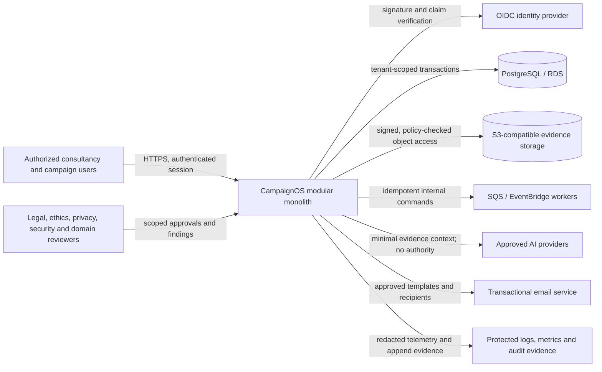

# CampaignOS system context

Status: **PROPOSED TARGET; current implementation is a partial foundation**
Last updated: `2026-07-19`

CampaignOS is a consultancy-owned, multi-tenant application. Authorized campaign users work inside explicit tenant and campaign memberships. External identity, model, storage, email, and AWS services provide bounded capabilities but do not own application authorization or campaign decisions.

## Trust boundaries

1. Browser input is untrusted, including object IDs, tenant IDs, role labels, uploaded files, and model-generated text.
2. OIDC establishes a cryptographically verified external subject. Application membership and authorization are separate database decisions.
3. Every repository and service operation must receive server-derived tenant/campaign scope; filters supplied by the client cannot widen it.
4. Model providers are external processors and untrusted recommendation sources. They cannot approve or execute sensitive actions.
5. Background messages are untrusted until their envelope, scope, actor, schema, idempotency key, and authorization provenance are validated.
6. Object storage is not an authorization layer. The application decides access before issuing a short-lived signed operation.
7. Operational telemetry must not leak tokens, secrets, private evidence, or unnecessary political data.

## Current implementation evidence

The repository currently has deterministic domain prototypes, hardened in-memory transaction/approval/evidence contracts, a static demo, a FastAPI/OIDC verification boundary, a tenant-scoped server-owned membership/grant loader, and a local PostgreSQL schema/RLS proof. Authorization loading is currently exposed only through the tenant identity projection; the repository does not yet enforce it on campaign-domain repositories/actions, run jobs, provide a production object-store adapter or dynamic frontend, define Terraform environments, or prove production operations. See `architecture/program-state.json` for the authoritative gate status.
